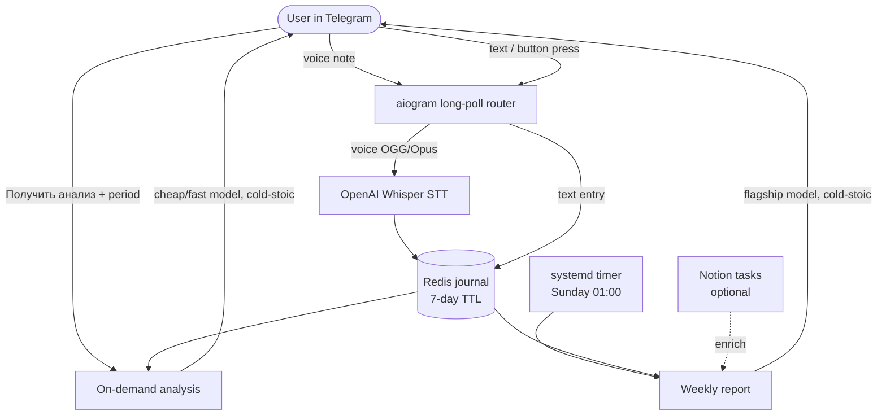

# Psycho Journal Bot

**Telegram voice-journaling bot with an AI cold-stoic therapist: Whisper STT → journal → on-demand and weekly analysis.**

[](https://github.com/M1zz1-ai/psycho-journal-bot/actions/workflows/ci.yml)

[](LICENSE)

Speak or type your thoughts to a Telegram bot. It transcribes voice with OpenAI
Whisper, stores each entry in a short-lived (7-day) Redis journal, and — on
demand or on a weekly schedule — hands the journal to an LLM that plays a **cold,
stoic therapist**: no flattery, dichotomy-of-control audits, and concrete Stoic
exercises grounded in Seneca, Epictetus, and Marcus Aurelius.

> 🇷🇺 Русская версия: **[README.ru.md](README.ru.md)** (the bot's own UX is Russian).

## Architecture



## Features

- **Voice-first journaling.** Send a voice note; it's transcribed via OpenAI
  Whisper (`core/stt.py`) and logged. Captions and plain text work too.
- **On-demand analysis.** Tap a button, name a period in free text ("за неделю",
  "май", "01.05-07.05"); a parser resolves it to dates, the in-window entries are
  gathered, and a cold-stoic analysis comes back in Russian markdown.
- **Weekly report.** A Sunday systemd timer builds a deeper report over the last
  7 days, optionally **enriched with the past week's tasks** (via an optional
  `notion-cli`; gracefully skipped when absent).
- **Two-tier model routing.** A cheap/fast model for the frequent on-demand path,
  a flagship model for the weekly deep dive — both env-overridable.
- **Structured outputs.** Period parsing and the report use JSON-schema-constrained
  completions, so downstream code gets typed dicts, not free text to re-parse.
- **Resilient by design.** Every model/Telegram call runs inside a resilience
  wrapper (`core/errors.py`): a transient failure is logged and alerted, never
  crashing the long-poll loop. Redis outages degrade to no-ops, not exceptions.

## Quickstart

**Prerequisites:** Python 3.14, [uv](https://docs.astral.sh/uv/), a running Redis
(`redis://localhost:6379` by default), a Telegram bot token from
[@BotFather](https://t.me/BotFather), and an OpenAI API key.

```bash
uv sync                       # create the venv and install deps
cp .env.example .env          # then edit .env with your real values
uv run python -m psycho --check   # validate config (no network)
uv run python -m psycho           # start the long-poll router
```

Send `/start` to your bot in Telegram, then journal away. To send one weekly
report immediately (what the systemd timer calls):

```bash
uv run python -m psycho --once
```

Production deployment templates (a long-poll service plus a Sunday report
timer) live in [`deploy/`](deploy/) — fill in the `CHANGE_ME` placeholders.

## Configuration

All config comes from a `.env` file at the repo root (see `.env.example`). No
secret is ever hard-coded.

| Key | Required | Purpose |
| --- | --- | --- |
| `TELEGRAM_BOT_TOKEN_PSYCHO` | ✅ | Bot token from @BotFather |
| `OPENAI_API_KEY` | ✅ | LLM analysis/report **and** Whisper STT |
| `TELEGRAM_CHAT_ID` | ✅ | Owner chat id (report + alerts) |
| `REDIS_URL` | — | Journal ledger (default `redis://localhost:6379`) |
| `PSYCHO_REPORT_MODEL` | — | Override the weekly-report model |
| `PSYCHO_ANALYSIS_MODEL` | — | Override the on-demand model |

## Design notes / war stories

**The weekly report that never fired.** The first version ran the weekly report
from an in-process `asyncio` scheduler — a loop that slept 7 days from process
start. In practice the process restarts (deploys, crashes, reboots) reset that
timer, so "every Sunday" silently became "roughly a week after the last restart,
maybe." The fix was to stop pretending an in-process sleep is a schedule: the
report became a `--once` oneshot fired by a **systemd timer** with
`OnCalendar=Sun *-*-* 01:00` and `Persistent=true` (so a missed run while the box
was off still fires on boot). The in-process path is still available behind
`PSYCHO_INPROC_REPORT=1` for hosts without systemd. See `deploy/` and
`psycho/report.py`.

**Swapping the LLM provider in one seam.** The bot originally ran on Anthropic.
When that had to change, the swap touched exactly one module: the tools and bot
logic depend only on a tiny agent interface (`.run()`, `.structured_output()`,
`.tool()`), so moving to OpenAI meant writing one `core/openai_agent.py` and
changing which client the factory constructs — not rewriting the pipeline. The
lesson baked into the layout: **depend on a narrow capability interface, not on a
vendor SDK.**

**Reasoning-model gotchas.** The current models are reasoning models, which means
(1) requests use `max_completion_tokens`, not `max_tokens`; (2) reasoning tokens
are drawn from that same budget, so token caps are set generously or the visible
answer can come back empty; (3) `temperature` is never sent. These are documented
right where they bite, in `core/openai_agent.py`.

## Testing

The suite is fully offline — the OpenAI client, Telegram, Redis, and `notion-cli`
are all faked, so no network or credentials are needed.

```bash
uv run pytest -q      # run the tests
uv run ruff check .   # lint
```

## Project layout

```
core/          # reusable, bot-agnostic building blocks
  openai_agent.py   # OpenAI chat/tool/structured-output agent
  stt.py            # OpenAI Whisper transcription
  state.py          # Redis journal + session store (graceful degradation)
  scheduler.py      # resilient async interval loop
  tg.py             # aiogram Telegram helpers
  config.py         # .env loading, fail-loud on missing keys
  errors.py         # shared errors + resilience wrapper
  notion.py         # optional notion-cli task lookup
psycho/        # the bot itself
  router.py         # message routing + wiring
  bot.py            # journal / analysis / report handlers
  tools.py          # routing rules, prompts, period parser, schemas
  analysis.py       # on-demand analysis surface
  report.py         # weekly report + optional task enrichment
  session_store.py  # journal enumeration over Redis
  __main__.py       # entrypoint (--check / --once / run)
tests/         # offline unit tests for core + psycho
deploy/        # systemd service + report timer templates
```

## License

MIT — see [LICENSE](LICENSE).
