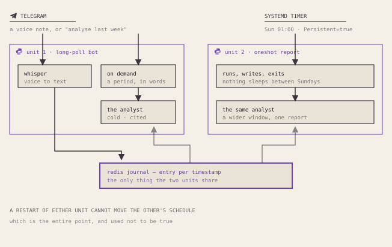
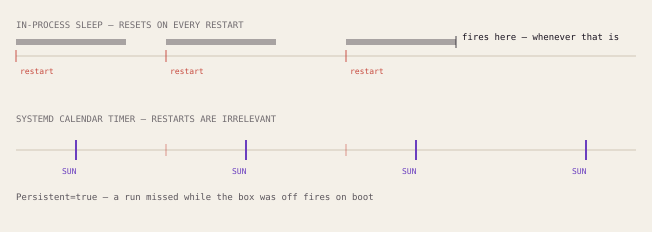

# Psycho Journal Bot

**Телеграм-бот для голосового дневника с ИИ в роли холодного стоического терапевта: Whisper STT → дневник → разбор по запросу и еженедельный отчёт.**

[](https://github.com/M1zz1-ai/psycho-journal-bot/actions/workflows/ci.yml)

[](LICENSE)

Наговариваешь или пишешь мысли телеграм-боту. Он расшифровывает голос через
OpenAI Whisper, складывает каждую запись в короткоживущий (7 дней) журнал в
Redis и — по запросу или по расписанию — отдаёт журнал модели, играющей роль
**холодного стоического терапевта**: без лести, с аудитом «дихотомии контроля» и
конкретными стоическими практиками по Сенеке, Эпиктету и Марку Аврелию.

> 🇬🇧 English version: **[README.md](README.md)**.

📊 Та же история полноэкранной витриной: **[sleep — это не расписание](https://m1zz1-ai.github.io/psycho-journal-bot/)** — восемь экранов о баге, из-за которого «каждое воскресенье» было неправдой.

## Архитектура

<picture>
  <source media="(prefers-color-scheme: dark)" srcset="docs/img/architecture-dark.svg">
  
</picture>

## Возможности

- **Голос в первую очередь.** Отправляешь голосовое — оно расшифровывается через
  Whisper (`core/stt.py`) и логируется. Подписи и обычный текст тоже работают.
- **Разбор по запросу.** Жмёшь кнопку, называешь период свободным текстом
  («за неделю», «май», «01.05-07.05»); парсер приводит его к датам, собираются
  записи за период, возвращается холодный стоический разбор в Markdown.
- **Еженедельный отчёт.** Воскресный systemd-таймер строит более глубокий отчёт
  за 7 дней, при желании **обогащённый задачами за неделю** (через опциональный
  `notion-cli`; аккуратно пропускается, если его нет).
- **Две модели.** Дешёвая/быстрая для частого разбора по запросу, флагманская для
  еженедельного отчёта — обе переопределяются через переменные окружения.
- **Структурированный вывод.** Разбор периода и отчёт используют вывод по
  JSON-схеме, так что дальше идут типизированные словари, а не сырой текст.
- **Отказоустойчивость.** Каждый вызов модели/Telegram обёрнут в защиту
  (`core/errors.py`): временный сбой логируется и уходит алертом, но не роняет
  long-poll. Сбой Redis деградирует в no-op, а не в исключение.

## Быстрый старт

**Нужно:** Python 3.14, [uv](https://docs.astral.sh/uv/), запущенный Redis
(`redis://localhost:6379` по умолчанию), токен бота от
[@BotFather](https://t.me/BotFather) и ключ OpenAI.

```bash
uv sync                       # создать окружение и поставить зависимости
cp .env.example .env          # затем впиши реальные значения в .env
uv run python -m psycho --check   # проверить конфиг (без сети)
uv run python -m psycho           # запустить long-poll роутер
```

Отправь боту `/start` в Telegram и веди дневник. Чтобы отправить один
еженедельный отчёт сразу (то, что вызывает systemd-таймер):

```bash
uv run python -m psycho --once
```

Шаблоны для продакшена (сервис long-poll + воскресный таймер отчёта) — в
[`deploy/`](deploy/); заполни плейсхолдеры `CHANGE_ME`.

## Конфигурация

Вся конфигурация — из файла `.env` в корне репозитория (см. `.env.example`).
Секреты нигде не зашиты в код.

| Ключ | Обязателен | Назначение |
| --- | --- | --- |
| `TELEGRAM_BOT_TOKEN_PSYCHO` | ✅ | Токен бота от @BotFather |
| `OPENAI_API_KEY` | ✅ | Модель для разбора/отчёта **и** Whisper STT |
| `TELEGRAM_CHAT_ID` | ✅ | Чат владельца (отчёт + алерты) |
| `REDIS_URL` | — | Журнал (по умолчанию `redis://localhost:6379`) |
| `PSYCHO_REPORT_MODEL` | — | Переопределить модель отчёта |
| `PSYCHO_ANALYSIS_MODEL` | — | Переопределить модель разбора |

## Заметки по дизайну

**Еженедельный отчёт, который не срабатывал.** Первая версия запускала отчёт из
внутрипроцессного `asyncio`-планировщика — цикл, спавший 7 дней от старта
процесса. На практике процесс перезапускается (деплои, падения, ребуты) и
сбрасывает этот таймер, так что «каждое воскресенье» тихо превращалось в «примерно
через неделю после последнего рестарта». Починка — перестать выдавать sleep за
расписание: отчёт стал `--once`-командой, которую запускает **systemd-таймер** с
`OnCalendar=Sun *-*-* 01:00` и `Persistent=true`. Внутрипроцессный путь остался за
флагом `PSYCHO_INPROC_REPORT=1`.

<picture>
  <source media="(prefers-color-scheme: dark)" srcset="docs/img/sleep-is-not-a-schedule-dark.svg">
  
</picture>


**Смена LLM-провайдера в одном шве.** Изначально бот работал на Anthropic. Когда
это пришлось менять, правка затронула ровно один модуль: логика зависит только от
узкого интерфейса агента (`.run()`, `.structured_output()`, `.tool()`), поэтому
переход на OpenAI — это один `core/openai_agent.py` и смена конструируемого
клиента, а не переписывание пайплайна. Урок в архитектуре: **зависеть от узкого
интерфейса возможностей, а не от SDK вендора.**

<picture>
  <source media="(prefers-color-scheme: dark)" srcset="docs/img/one-seam-provider-swap-dark.svg">
  
</picture>


## Тесты

Набор полностью офлайн — клиент OpenAI, Telegram, Redis и `notion-cli`
подменяются фейками, сеть и креды не нужны.

```bash
uv run pytest -q      # тесты
uv run ruff check .   # линт
```

## Лицензия

MIT — см. [LICENSE](LICENSE).
